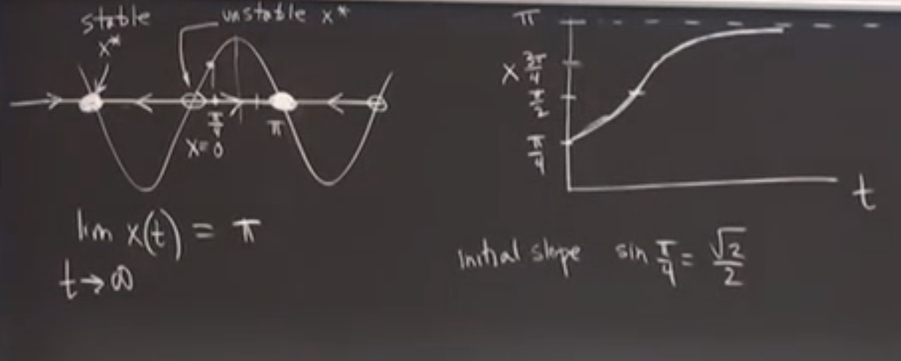
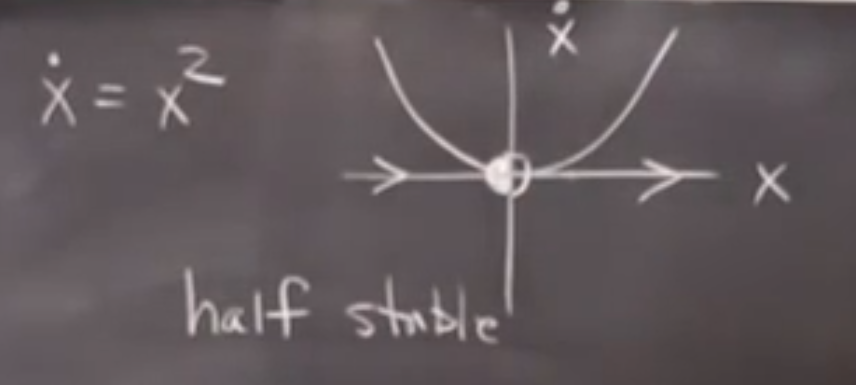
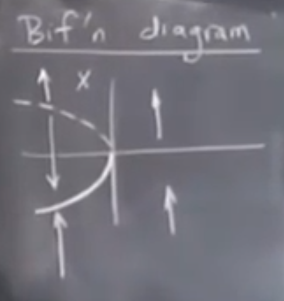
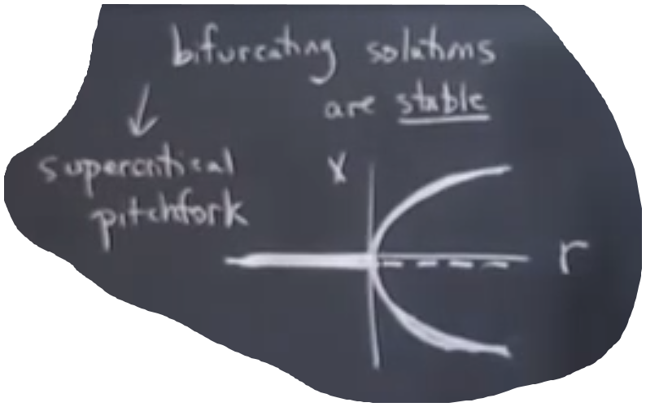

# Nonlinearity Dynamics and Chaos

## Introduction

- History:

  - 1666, Newton, three-body problem
  - 1900, Poincare proved the problem has no close form solution (chaos)
    - Use a geometic way rather than finding analytic solution, but not understood by others
    - Chaos:
      - Deterministic system
      - Aperiodic, seemingly unpredictable behaviour
      - Sensitive dependence on initial conditions (exponential divergence)
  - 1920-1950, non-linear oscillation in physics (e.g. radar)
  - 1960, Lorenz used computer for research in atmosphere
  - 1960s, KMM theory
  - ~1975
    - *chaos in iterated maps* (May)
    - fractals (Mandelbrot)
    - non-linear oscillators in biology (Winfree)
    - Turbulence in fluid (Ruelle & Takens)
  - 1978, *universal route to chaos* (Fergenbaum)
    - connection to phase transition in statistical physics through renormalization group
  - 1980s, becoming very popular, experimental confirmations
  - 1990s, engineering applications
  - 2000s, complex systems (historically chaos is about simple system with few parameters), network theory

- Logical structure of dynamics:

  - $$\dot{x} = f(x), x\in \R^n$$ is a vector in phase space
  - Linearity: all f(x) has only first power of x (but not necessarily first-order, see below)
    - Simple harmonic oscillator: $$m\ddot{x} + kx = 0$$
    - Let $$\vec{x} = (x, \dot{x})$$, then it can be written into a linear form (second order)
    - Another example: pendulum is not linear
  - Autonomous system:
    - f(x) is time-independent (otherwise you can include t as a parameter too)
    - Keeping the vector field static (for geometric method to be used)

- Geometric way:

  - A solution of the system (x1(t), x2(t)) is a tracjectory in the phase space
  - Many things can be done only through the phase portrait (picture of all **qualitatively** different trajectories) rather than solving the ODE

- A big picture:

  | System \ N of Parameters | 1                          | 2                   | 3 (chaos begins)       | >3   | >>1 (complex systems) | Continuous (complex systems)                              |
  | ------------------------ | -------------------------- | ------------------- | ---------------------- | ---- | --------------------- | --------------------------------------------------------- |
  | Linear                   | RC-oscillation             | Harmonic oscillator |                        |      |                       | Electromagnetic wave, Schrodinger equation, (linear PDEs) |
  | Non-linear               | Logistic population growth | Pendulum            | Lorenz system, fractal |      | networks              | General relativity                                        |

## One-Dimensional System

- Examples:
  - $$\dot{x} = \sin x$$, a sine wave in phase space
  - Stable and unstable fixed points (where velocity is 0)
  - 
- Another example: population growth
  - $$\dot{x} = rx(1 - x/K)$$, where K is the carring capacity
  - per-capita growth rate $$\dot{x}/x$$ is linear to population (passing (0, r) and (K, 0)) rather than static (without competition, exponential growth)

- Perturbation around fixed points

  - Let $$x^*$$ be a fixed point and $$\eta(t)$$ is the perturbation

  - Using first order Taylor equation we can approximate the system as $$0 + \dot{\eta} = 0 + \eta f'(x^*)$$, which is called linearization

  - So if $$f'(x^*) > 0$$, $$x^*$$ is unstable (exponentially deviating), if it's negative then that's stable, if it equals to 0, then linearization provides no information about stability. For example, it can be half-stable:

    

- Solution to 1D system:
  - Existence and uniqueness: if f(x) is continuously differentiable, then there exists a unique solution
  - Possible dynamics: x approximates infinity or a fixed point when time approximates infinity (most importantly, no oscillation)
    - x can only increase or decrease monotonously, since f(x) can only be positive or negative at each point

## Bifurcation (1D)

- Concept:
  - A heavy block on a thin stick may fall down from the left or right side with small perturbation
  - Bifurcation: As a parameter changes at a specific value (bifurcation point or value), the structure of the vector field changes dramatically - fixed points created or destroyed, or stability changed

- Saddle-point bifurcation (simplified version):

  - Creation of (a pair of stable and unstable) fixed points
  - $$\dot{x} = r + x^2$$, where r is the control parameter
  - When r < 0, there will be a pair of stable and unstable fixed points; when r=0, they merge into one half stable fixed point; when r > 0 it disappears

- Bifurcation diagram:

  - Plot of $$x^*$$ over r, e.g. for saddle-point bifurcation:

    

    (Vector represents moving direction, fixing r; dash line represents unstable fixed points)

  - Saddle-point bifurcation happens at the tangent point:

    - Consider $$\dot{x} = r + x - \ln(1 + x)$$, bifurcation happens at the point when $$y = r+x$$ is tangent to $$y = \ln(1 +x)$$, i.e. r = 0 & x = 0
    - Around the tangential point (x,r) = (0,0), Taylor euqation gives $$\dot{x} = r + \frac{x^2}{2} + o(x^2)$$ ("no information" situation)
    - This kind of bifurcation is called the normal form
  
- Transcritical bifurcation:

  - Consider $$\dot{x} = rx - x^2$$, which has a fixed point at 0 that is irrelevant with r
    - E.g. for population, n=0 is always a fixed point
    - But the stability can be changed
  - The bifurcation diagram is like a relu function ("exchange of stability")
    - When r = 0, half stable

- Pitchfork bifurcation:

  - Usually in system with symmetry, e.g. $$\dot{x} = rx - x^3$$

  - r < 0, one (exponentially) stable fixed point x = 0; r = 0, one stable fixed point x = 0; r > 0, one unstable fixed point x = 0 and a pair of stable fixed point

    - When the bifurcating solutions (here the new pair of fixed points) are stable, the bifurcating point is called supercritical point

  - Bifurcation diagram is like a pitchfork:

    

