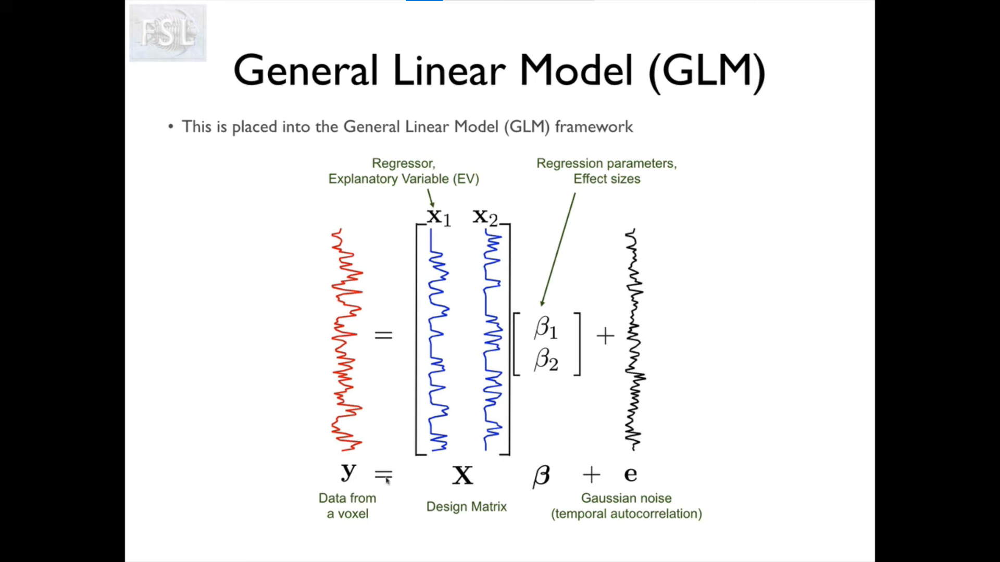

# MRI

Based on [FSL's courses](https://open.win.ox.ac.uk/pages/fslcourse/website/online_materials.html).

## Registration

- Align voxels to brain areas for:
  - motion correction
  - across-subject analysis
  - etc.
- Coordinate space:
  - standard spaces: e.g. MNI152
    - real Euclidean space in units of *mm*
    - origin near the center of the brain (defined anatomically, e.g. anterior commisure)
    - x axis points to the right, y axis points to the top, z axis points to the front (nose)
  - Image space: e.g. FSL coordinate
    - integer, orthogonal coordinates
    - label each voxel by its lower-left coner;
    - **not** aligned with anatomy
- Sptial transformations:
  - Rigid: used for within-subject motion correction
  - Affine:
    - for eddy current correction
    - for initializing non-linear registration
  - Non-linear:
    - Constraints:
      - Basis functions: e.g. B-spline
      - Regularization
      - Topology perservation
    - Used for between-subject registration
    - the smoothness is controlled by warp resolution (the lower the smoother)
- Registration with FSL:
  - fMRI and Diffusion tools: FEAT, MELODIC, FDT
    - main algorithm used: FNIRT and FLIRT (FMRIB's Non-linear/Linear Image Registration Tools)
  - Preliminary steps:
    - Reorientation (`fslreorient2std`)
    - Brain Extraction (`BET`)
    - Bias-field correction (`FAST`)
  - Single-stage registration:
    - Usage: align multimodal data within one subject
    - Algorithm: rigid body FLIRT
    - Cost function: multi-modal cost function (e.g. correlation ratio by default)
    - Steps:
      - Run brain extraction for both image
      - Align the one with lower quality to the one with higher quality
      - Check the result by eye, using `fsleyes` or `slices`
  - Multi-stage registration:
    - Usage: 
      - functional or diffusion group study in a common space (e.g. MNI152)
      - having EPI (echo planar imgaing, incluing fMRI/DTI) and T1-weighted images of each subject
    - Algorithm: FLIRT and then FNIRT in `FEAT` GUI
    - Steps:
      - Extract the brain in T1 image (usually no need to do so for EPI image)
      - Rigid transformation from individual EPI to T1
      - Non-linear transformation from T1 to standard space
    - Implementation: `FEAT` (fMRI Expert Analysis Tool)
      - Only need to specify the structural image and standard space
      - However, actually both the brain extracted and original structural image will be used, as well as the EPI image
      - Therefore, make sure you follow the naming convention so FSL can infer the files
- EPI distortion correction:
  - B~0~ unwrapping:
    - EPI is fast and thus suffering from inhomogeneous B~0~ field
      - distortion
      - signal loss
      - typically in inferior frontal and temporal lobes
    - The B~0~ deviation can be measured by a seperate *fieldmap* image
      - should be measured for each session
      - needs several minutes, but massively improves signal quality
      - needs to use both amplitude and phase information, as well as the echo time difference (deltaTE)
    - Unwraping with fieldmaps (in `FEAT`) can help registration (but will not restore the lost signal)
  - Boundary-based Registration (BBR) is a cost function that aims to align EPI by white-matter boundaries and can improve registration quality

## fMRI Image Preprocessing

- Reconstruction from k-space data: check for wrapping, RF interference, etc.
- Motion correction: rigid body transformation
- Slice timing correction:
  - fMRI acquires the image for one (in some case maybe several) slice at a time, so there is a small delay between different slices
  - can be corrected by:
    - shifting and interpolating data (not recommended, will cause signal loss)
    - shifting hemodynamic response functions (HRFs) in the GLM model used in following analysis (recommended)
    - in practice: subtracting the first order derivative of HRF to shift it (based on Talor expansion)
  - more complicated if coupled with motion problem, may be corrected by:
    - including motion regressors in GLM
    - ICA
    - exclusion of data
- Spatial filtering:
  - can improve SNR and help the statistics if the kernal size is suitable
  - is required for some statistical method:
    - e.g., Gaussian random field theory for thresholding assumes minimal smoothness
    - some methods doesn't need it, e.g. randomise, TFCE
  - in practice: only use small amount of smoothing (if any)
    - full width half maximum (FWHM) < 5mm
- Temporal filtering:
  - only recommend high-pass filtering
  - only remove very slow components in order to better estimate the autocorrelation
    - e.g. TR=3s, then cutoff period should be longer than 90s
  - only remove those components that are even slower than the intrinsic frequency of your task design (e.g. trial length)
    - can be estimated in `FEAT`, which calculates a cutoff period that preserves 90% of the signal-of-interest
- Global intensity normalization: scale the data so the overall mean intensity is the same across sessions and subjects

## Event-based fMRI Analysis

- Basically it is just a linear regression:

  

- $X_1, X_2$ are some explanatory variables, which is the convolution of the HRF and the design (discrete events, e.g. displaying a face image, displaying an environment, etc.), downsampled to align with the TRs
- $\beta$ contains the neural response at each voxel for each kind of event (explanatory variable)
- $\beta$ can then be evaluated by certain contrast-of-parameter-estimates (COPE), e.g. t-test or F-test
- Note: in FSL, the mean is subtracted before modeling for first-level analysis, but it is modeled by a term in high-level analysis